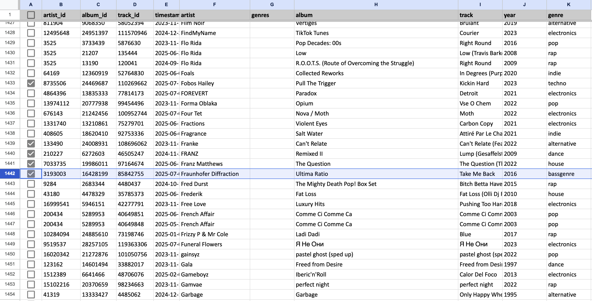

# ymusic-liketable

Скрипт для получения таблицы со всеми лайками на музыку. Если снимать галочки в таблице, лайки будут сняты и это позволяет управлять рекомендациями "волны", например.

Позволяет точнее настроить работу рекомендаций/vibe, убрать много лайков за раз или вернуть позже.

### Использование

 1. Получить токен из браузера https://github.com/MarshalX/yandex-music-api/discussions/513. Сохранить в `token.txt`
 3. Зависимости 
      `poetry install --no-root`
 4. Выполнение
      `poetry run python example_xlsx.py`
 7. Снять ненужные лайки, сортируя треки по жанрам, году, названию, времени лайка и т.д.
 9. Перезапуск скрипта обновит лайки -- снимет или поставит обратно.

Если новый лайк поставлен в приложении, но его нет в файле, он добавляется в файл. Если ранее он был снят вручную, в таблице будет снова поставлен.

Если лайк снят в приложении, это будет отражено в таблице. В том числе пустым timestamp.

**Example**: `example_xlsx.py`

#### Google Sheets API
Можно работать с таблицей [google sheets](https://sheets.google.com/) как хранилещем таблицы, вместо XLSX.

Что нужно:

 - Создать проект с помощью Google Console (для получения `creds.json`)
 - Включить в консоли конкретного проекта [Sheets API](https://console.cloud.google.com/apis/library/sheets.googleapis.com)
 - Скачать JSON с ключем проекта в режиме **Service Account** (as `creds.json`)
 - Создать гугл таблицу (взять ссылку для `table_url`)
 - Поделиться таблицей на адрес `client_email` из creds

 **Example**: `example_google.py`